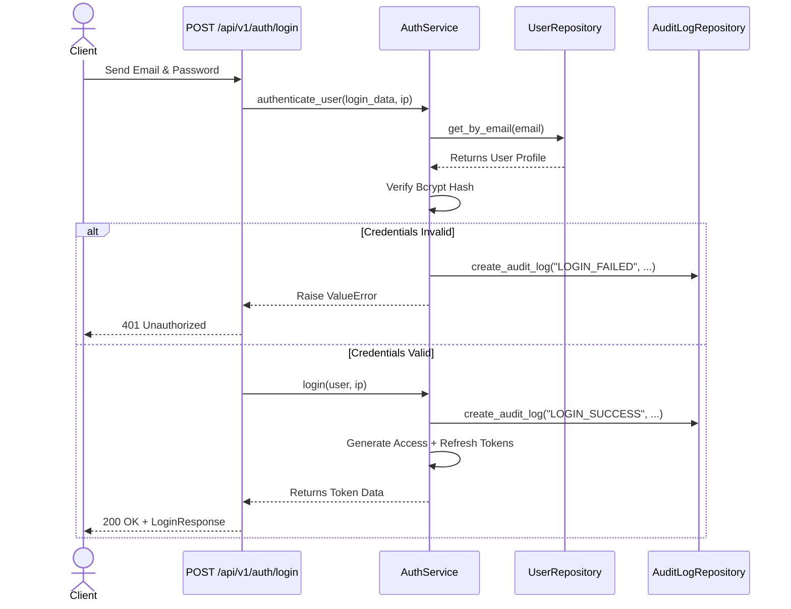
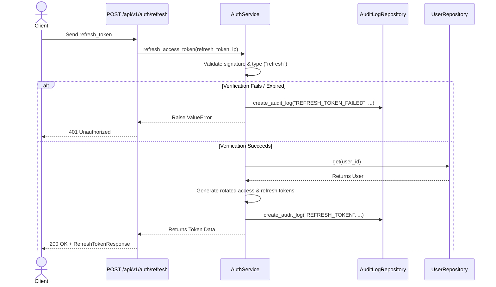

# NEERON Authentication & RBAC Developer Guide

This document describes the design, API endpoints, flow diagrams, token lifecycle, and authorization mechanisms of the NEERON Precision Aquaculture Intelligence Platform.

---

## 1. Core Architecture

The security infrastructure separates identity verification and authorization into three distinct layers following the project's **Repository → Service → API** design pattern:

```
┌────────────────────────────────────────────────────────────────────────┐
│                        FastAPI APIRouter                               │
│                (app/api/v1/auth.py & app/api/v1/users.py)              │
└───────────────────────────────────┬────────────────────────────────────┘
                                    │ (FastAPI Depends)
┌───────────────────────────────────▼────────────────────────────────────┐
│                        Route Dependencies                              │
│             (app/api/v1/dependencies/auth.py & app/core/rbac.py)       │
└───────────────────────────────────┬────────────────────────────────────┘
                                    │ (Service Injection)
┌───────────────────────────────────▼────────────────────────────────────┐
│                        Service Layer                                   │
│              (app/services/auth_service.py & UserService)              │
└───────────────────────────────────┬────────────────────────────────────┘
                                    │ (Repository Operations)
┌───────────────────────────────────▼────────────────────────────────────┐
│                        Repository Layer                                │
│           (UserRepository & AuditLogRepository)                       │
└────────────────────────────────────────────────────────────────────────┘
```

---

## 2. JWT Lifecycle & Token Rotation

We enforce **Token Rotation** on every refresh request. When a user requests a new access token, their old refresh token is invalidated, and a new pair of access and refresh tokens is returned.

### Specifications
* **Encryption Algorithm**: HS256 (HMAC-SHA256)
* **Access Token Expiry**: 30 minutes (customizable via `ACCESS_TOKEN_EXPIRE_MINUTES`)
* **Refresh Token Expiry**: 7 days (customizable via `REFRESH_TOKEN_EXPIRE_DAYS`)
* **Signature Key**: Centralized config key `JWT_SECRET_KEY`

### Claims Structure
* **Access Token**:
  ```json
  {
    "sub": "UUID-string-of-user-id",
    "exp": 1719253456,
    "type": "access"
  }
  ```
* **Refresh Token**:
  ```json
  {
    "sub": "UUID-string-of-user-id",
    "exp": 1719858256,
    "type": "refresh"
  }
  ```

---

## 3. Flow Diagrams

### Login Flow


### Refresh Flow


---

## 4. Role-Based Access Control (RBAC)

The RBAC system maps permissions directly to database-stored roles.

### Predefined Roles
Our role hierarchy contains the following roles (defined in [role.py](file:///c:/Users/ritvi/Downloads/neeron/neeron/backend/app/models/role.py)):
1. **Administrator**: Platform superuser. Bypasses all permission constraints.
2. **Operations Manager**: Farm supervisor. Permissions include water management actions.
3. **Aquaculture Analyst**: Data analyst. Permissions include reading telemetry and running prediction tools.
4. **Biologist**: Biosecurity worker. Permissions include health reports and biosecurity forms.
5. **Viewer**: Read-only access to basic dashboards.

### RBAC Implementation Example
FastAPI endpoint handlers restrict access using dependency injection:

```python
from fastapi import APIRouter, Depends
from app.core.rbac import require_roles, require_permissions
from app.api.v1.dependencies.auth import get_current_active_user
from app.models.user import User

router = APIRouter()

# 1. Gate access by Role Name
@router.post("/farms", dependencies=[Depends(require_roles("Administrator", "Operations Manager"))])
async def create_farm():
    return {"status": "Farm created"}

# 2. Gate access by Granular Permissions
@router.put("/tanks/{tank_id}/thresholds", dependencies=[Depends(require_permissions("write:tanks"))])
async def update_thresholds(tank_id: str):
    return {"status": "Thresholds updated"}
```

---

## 5. Security API Reference

### 1. Endpoints
* **Login**: `POST /api/v1/auth/login`
  Authenticates user and generates bearer tokens.
* **Token Rotation**: `POST /api/v1/auth/refresh`
  Exchanges an active refresh token for a rotated access and refresh token.
* **Logout**: `POST /api/v1/auth/logout`
  Revokes session audit trail context.
* **Profile**: `GET /api/v1/auth/me`
  Returns current authenticated user fields, assigned role name, and permissions JSON dictionary.

### 2. Audit Trail System
All security actions are automatically saved in the TimescaleDB immutable `audit_logs` table (partitioned by time). Recorded event types:
- `LOGIN_SUCCESS`: successfully authenticated login credentials.
- `LOGIN_FAILED`: unsuccessful login attempts.
- `LOGOUT`: user logged out.
- `REFRESH_TOKEN`: rotated tokens issued.
- `REFRESH_TOKEN_FAILED`: unsuccessful token refresh attempt.
