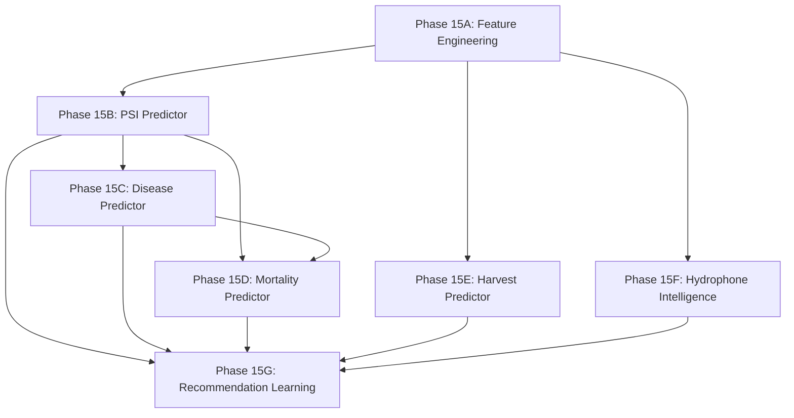

# NEERON ML Implementation Roadmap

> Phased implementation plan for the NEERON ML system.
> Each phase is scoped as an independent deliverable with clear objectives,
> required datasets, expected outputs, and implementation complexity.

---

## Roadmap Overview

```
Phase 15A ──▶ Phase 15B ──▶ Phase 15C ──▶ Phase 15D ──▶ Phase 15E ──▶ Phase 15F ──▶ Phase 15G
Feature       PSI           Disease       Mortality      Harvest       Hydrophone    Recommendation
Engineering   Predictor     Predictor     Predictor      Predictor     Intelligence  Learning
(Foundation)  (First Model) (Biosecurity) (Early Warning)(Production)  (Acoustic)    (Feedback Loop)
```

All phases are additive. No phase requires modifying database schema, API contracts, or existing services from earlier phases.

---

## Phase 15A: Feature Engineering

### Objectives

1. Build the feature computation pipeline that populates the `ml_feature_store` table.
2. Implement all engineered features documented in the ML Feature Catalog.
3. Establish data quality gating between raw telemetry and feature store.
4. Validate point-in-time correctness of feature timestamps.

### Datasets Required

| Dataset | Source Table | Volume Estimate |
|---|---|---|
| Raw telemetry | `telemetry` | 5-second intervals × sensors per tank × tanks |
| Environment snapshots | `tank_environment_snapshots` | 5-second intervals × tanks |
| Production metrics | `tank_production_metrics` | Daily per tank |
| Quality checks | `data_quality_checks` | One per telemetry batch per sensor |

### Expected Outputs

| Output | Description |
|---|---|
| Feature computation workers | Async workers that compute telemetry, biological, environmental, and engineered features |
| `ml_feature_store` populated | All 32 features from the Feature Catalog written to the hypertable |
| Data quality integration | Features linked to `data_quality_checks.result` — only `Pass`/`Suspect` data enters the store |
| Feature freshness monitoring | Alerting when features are stale (no new rows for > 10 minutes) |
| Feature validation tests | Automated tests verifying feature ranges, types, and completeness |

### Implementation Components

| Component | Files | Description |
|---|---|---|
| Feature workers | `app/workers/feature_*.py` | Async computation pipelines per feature group |
| Feature repository | `app/repositories/feature_repository.py` | CRUD + time-range queries on `ml_feature_store` |
| Feature service | `app/services/feature_service.py` | Orchestration: quality gate → compute → store |
| Quality gate | `app/services/data_quality_service.py` | Filter features by quality check results |

### Implementation Complexity

| Dimension | Rating | Rationale |
|---|---|---|
| Schema changes | None | `ml_feature_store` and `data_quality_checks` already exist |
| Code volume | Medium | ~800–1,200 lines of feature computation logic |
| Testing effort | Medium | Each feature needs unit tests for correctness and temporal alignment |
| Dependencies | None | Pure Python + SQLAlchemy; no external ML libraries yet |
| Risk | Low | Infrastructure-only; no model training or serving |

**Estimated Duration:** 1–2 weeks

---

## Phase 15B: PSI Predictor

### Objectives

1. Train and validate the first production ML model: the PSI Predictor.
2. Register the model in `ai_models` and `model_versions`.
3. Implement the inference pipeline that writes to `psi_predictions` and `psi_factors`.
4. Establish the model health monitoring pipeline via `model_health_metrics`.
5. Connect predictions to the existing `GET /api/v1/predictions/disease` endpoint.

### Datasets Required

| Dataset | Source | Minimum Volume |
|---|---|---|
| Feature store: telemetry features | `ml_feature_store` WHERE `feature_group = 'telemetry'` | 90 days × all tanks |
| Feature store: engineered features | `ml_feature_store` WHERE `feature_group = 'engineered'` | 90 days × all tanks |
| Labels: expert-annotated PSI scores | Manual labeling or heuristic derivation from water quality indices | ≥ 10,000 labeled samples |

### Expected Outputs

| Output | Description |
|---|---|
| Trained XGBoost model | Serialized to `artifact_uri`, RMSE < 0.50, R² > 0.90 |
| `ai_models` registry entry | "PSI Predictor", algorithm "XGBoost", status "Production" |
| `model_versions` entry | v1.0.0 with hyperparameters and evaluation metrics JSON |
| Inference worker | Async worker running inference every 5 minutes per tank |
| `psi_predictions` rows | Live predictions with `model_version_id` FK |
| `psi_factors` rows | SHAP factor breakdowns per prediction |
| Health monitoring | `model_health_metrics` written every 6 hours |

### Implementation Components

| Component | Files | Description |
|---|---|---|
| Training script | `ml/training/psi_trainer.py` | Data loading, training, evaluation, artifact serialization |
| Inference worker | `app/workers/psi_inference.py` | Feature retrieval → model loading → prediction → DB write |
| SHAP extraction | `app/workers/psi_explainer.py` | SHAP value computation and `psi_factors` population |
| Health monitor | `app/workers/model_health_monitor.py` | Periodic evaluation metrics computation |

### Implementation Complexity

| Dimension | Rating | Rationale |
|---|---|---|
| Schema changes | None | `psi_predictions`, `psi_factors`, `ai_models`, `model_versions` already exist |
| Code volume | Medium-High | ~1,500–2,000 lines (training + inference + explainability + monitoring) |
| Testing effort | High | Model accuracy validation, SHAP correctness, integration tests |
| Dependencies | New | XGBoost, SHAP, scikit-learn, joblib |
| Risk | Medium | First production model — establishes patterns for all subsequent models |

**Estimated Duration:** 2–3 weeks

---

## Phase 15C: Disease Predictor

### Objectives

1. Train the Disease Risk Predictor with multi-class pathogen classification.
2. Integrate biosecurity records and pathogen history as input features.
3. Implement multi-horizon predictions (7, 14, 30 days).
4. Connect to the `RecommendationEngineService` for automated biosecurity recommendations.

### Datasets Required

| Dataset | Source | Minimum Volume |
|---|---|---|
| Feature store: telemetry + environmental | `ml_feature_store` | 180 days × all tanks |
| Production metrics | `tank_production_metrics` | 180 days × all tanks |
| Biosecurity records | `biosecurity_records` | All historical detections per tank |
| Pathogen catalog | `pathogens` | Reference table (curated) |
| Labels: confirmed disease events | `biosecurity_records` WHERE `risk_level IN ('High', 'Critical')` | ≥ 500 positive events |

### Expected Outputs

| Output | Description |
|---|---|
| Trained XGBoost classifier | Per-pathogen models; F1 > 0.80, ROC-AUC > 0.90 |
| `disease_predictions` rows | Per-tank, per-disease, per-horizon predictions |
| Recommendation integration | Disease predictions > 0.35 trigger automated biosecurity recommendations |
| CBR matching | Disease predictions matched against `historical_cases` via `case_matches` |

### Implementation Complexity

| Dimension | Rating | Rationale |
|---|---|---|
| Schema changes | None | `disease_predictions`, `biosecurity_records` already exist |
| Code volume | Medium | ~1,200–1,500 lines (multi-class extends Phase 15B patterns) |
| Testing effort | High | Class imbalance validation, multi-horizon accuracy testing |
| Dependencies | Extends | LightGBM added alongside XGBoost |
| Risk | Medium | Sparse disease event data may limit recall |

**Estimated Duration:** 2 weeks

---

## Phase 15D: Mortality Predictor

### Objectives

1. Train the Mortality Predictor using cascaded model outputs (PSI + Disease → Mortality).
2. Implement multi-horizon mortality probability forecasting (7, 14, 30 days).
3. Validate against actual mortality records from `tank_production_metrics`.

### Datasets Required

| Dataset | Source | Minimum Volume |
|---|---|---|
| PSI prediction history | `psi_predictions` | 90 days (from Phase 15B) |
| Disease prediction history | `disease_predictions` | 90 days (from Phase 15C) |
| Production metrics | `tank_production_metrics` | 180 days (mortality_rate as label) |
| Feature store: engineered | `ml_feature_store` WHERE `feature_name IN ('psi_ma_7d', 'mortality_trend_7d', 'growth_rate_daily', 'water_quality_index')` | 180 days |

### Expected Outputs

| Output | Description |
|---|---|
| Trained Random Forest models | Separate models for 7/14/30-day horizons; MAE < 0.08 |
| `mortality_predictions` rows | Per-tank, per-horizon probability forecasts |
| Confidence intervals | 90% CI bounds populated in `confidence_low`/`confidence_high` |

### Implementation Complexity

| Dimension | Rating | Rationale |
|---|---|---|
| Schema changes | None | `mortality_predictions` already exists |
| Code volume | Low-Medium | ~800–1,000 lines (reuses Phase 15B training patterns) |
| Testing effort | Medium | Multi-horizon validation, cascade dependency testing |
| Dependencies | Extends | Random Forest from scikit-learn (already available) |
| Risk | Low | Mature training patterns established in 15B/15C |

**Estimated Duration:** 1–2 weeks

---

## Phase 15E: Harvest Predictor

### Objectives

1. Train the Harvest Predictor using completed grow-out cycle data.
2. Implement harvest date, biomass yield, and mean weight projections.
3. Integrate market price data for revenue projections (optional).

### Datasets Required

| Dataset | Source | Minimum Volume |
|---|---|---|
| Completed grow-out cycles | `tank_production_metrics` full histories | ≥ 10 completed cycles per species |
| Feature store: biological | `ml_feature_store` WHERE `feature_group = 'biological'` | 365 days |
| Feature store: engineered | `ml_feature_store` WHERE `feature_name IN ('biomass_trajectory', 'fcr_deviation', 'growth_rate_daily', 'water_quality_index')` | 365 days |
| Environmental features | `tank_environment_snapshots` (temperature seasonality) | 365 days |

### Expected Outputs

| Output | Description |
|---|---|
| Trained XGBoost model | Harvest date MAE < 3 days, biomass MAPE < 5% |
| `harvest_predictions` rows | Per-tank date, biomass, weight, FCR trajectory predictions |
| Revenue projections | Optional `revenue_projection_usd` when market data is available |

### Implementation Complexity

| Dimension | Rating | Rationale |
|---|---|---|
| Schema changes | None | `harvest_predictions` already exists |
| Code volume | Medium | ~1,000–1,200 lines (growth curve modeling is domain-specific) |
| Testing effort | Medium | Requires completed grow-out cycle data for validation |
| Dependencies | Extends | XGBoost (already available from Phase 15B) |
| Risk | Medium | Data availability — requires multiple completed grow-out cycles |

**Estimated Duration:** 2 weeks

---

## Phase 15F: Hydrophone Intelligence

### Objectives

1. Implement Phase 1: Statistical acoustic pattern detection (threshold-based, no ML).
2. Prepare data pipelines for Phase 2: CNN spectrogram classification.
3. Populate acoustic features in `ml_feature_store`.
4. Establish acoustic baseline per tank for anomaly detection.

### Datasets Required

| Dataset | Source | Minimum Volume |
|---|---|---|
| Hydrophone readings | `tank_environment_snapshots` (`acoustic_db`, `bio_acoustic_sync`) | 30 days per tank with active hydrophone |
| Acoustic analytics | `GET /api/v1/telemetry/acoustic/history` time-series | 30 days |
| Behavioral observations | Manual operator logs (future labeling source) | Pilot dataset |

### Expected Outputs

| Output | Description |
|---|---|
| Acoustic feature pipeline | `ml_feature_store` populated with `acoustic_stability_score`, `bio_acoustic_deviation`, `avg_acoustic_db_1h`, `acoustic_db_std_1h` |
| Per-tank baselines | Historical median `acoustic_db` and `bio_acoustic_sync` stored for deviation detection |
| Phase 2 data collection | Audio capture pipeline for spectrogram generation (infrastructure only) |
| Status classification refinement | Improved `Normal`/`Warning`/`Critical` thresholds from statistical analysis |

### Implementation Complexity

| Dimension | Rating | Rationale |
|---|---|---|
| Schema changes | None | `acoustic_db`, `bio_acoustic_sync` columns already exist (Phase 10.1) |
| Code volume | Low-Medium | ~600–800 lines (statistical detection, feature computation) |
| Testing effort | Low | Threshold-based logic is deterministic and easily testable |
| Dependencies | None (Phase 1) | Pure Python + SQLAlchemy for statistics |
| Risk | Low | Phase 1 is non-ML; Phase 2 requires audio data collection (separate effort) |

**Estimated Duration:** 1 week

---

## Phase 15G: Recommendation Learning

### Objectives

1. Close the feedback loop: aggregate `recommendation_feedback` into model retraining signals.
2. Implement feedback-weighted retraining for all prediction models.
3. Build acceptance rate monitoring and automatic retraining triggers.
4. Refine CBR matching using effectiveness-scored case outcomes.

### Datasets Required

| Dataset | Source | Minimum Volume |
|---|---|---|
| Recommendation feedback | `recommendation_feedback` | ≥ 200 rated recommendations |
| Recommendation actions | `recommendation_actions` | All operator Accept/Reject/Ignore records |
| Prediction history | All prediction hypertables | Full history from Phases 15B–15E |
| Case match history | `case_matches` | All CBR matches |

### Expected Outputs

| Output | Description |
|---|---|
| Feedback aggregation pipeline | Converts `effectiveness_score` + `action_taken` into training labels |
| Weighted retraining | Models retrained with feedback-weighted loss functions |
| Acceptance rate monitor | Automated alerting when acceptance rate drops below 50% |
| CBR refinement | Case similarity scoring improved using outcome data |
| Model health dashboards | Updated `model_health_metrics` with feedback-derived accuracy |

### Implementation Complexity

| Dimension | Rating | Rationale |
|---|---|---|
| Schema changes | None | `recommendation_feedback`, `recommendation_actions` already exist |
| Code volume | Medium | ~1,000–1,200 lines (feedback pipeline, weighted retraining, monitoring) |
| Testing effort | High | End-to-end loop validation, feedback aggregation accuracy |
| Dependencies | Extends | All Phase 15B–15F models must be deployed |
| Risk | Medium | Requires sufficient recommendation volume for statistical significance |

**Estimated Duration:** 2 weeks

---

## Timeline Summary

| Phase | Name | Duration | Prerequisites | Key Deliverable |
|---|---|---|---|---|
| **15A** | Feature Engineering | 1–2 weeks | None | `ml_feature_store` populated with all 32 features |
| **15B** | PSI Predictor | 2–3 weeks | 15A | First production ML model; SHAP explainability |
| **15C** | Disease Predictor | 2 weeks | 15A, 15B | Multi-pathogen disease risk forecasting |
| **15D** | Mortality Predictor | 1–2 weeks | 15B, 15C | Cascaded mortality probability forecasting |
| **15E** | Harvest Predictor | 2 weeks | 15A | Harvest date and yield projections |
| **15F** | Hydrophone Intelligence | 1 week | 15A | Acoustic baselines and statistical detection |
| **15G** | Recommendation Learning | 2 weeks | 15B–15F deployed | Closed feedback loop, weighted retraining |

**Total Estimated Duration:** 11–14 weeks

```
Week  1  2  3  4  5  6  7  8  9  10  11  12  13  14
      ├──15A──┤
               ├────15B─────┤
                              ├───15C───┤
                     ├───15E───┤         ├──15D──┤
               ├15F─┤                             ├───15G───┤
```

Phases 15A → 15B → 15C → 15D are sequential (each depends on the previous).
Phases 15E and 15F can run in parallel with 15B/15C after 15A completes.
Phase 15G requires all models to be deployed and generating operator feedback.

---

## Dependency Graph


